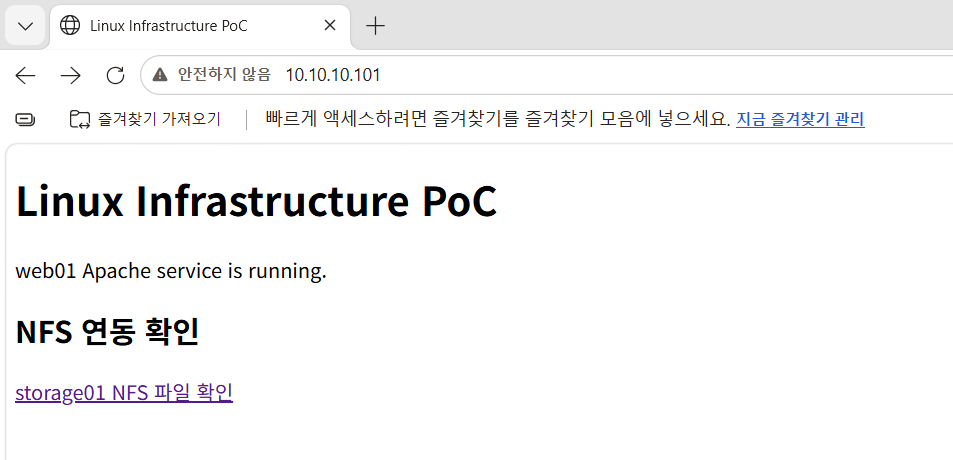
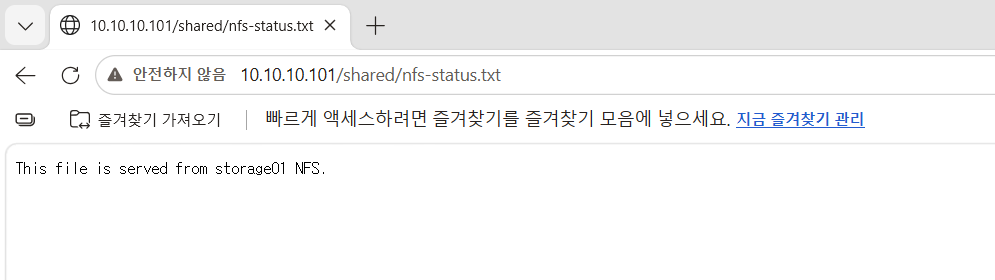

# web01 Apache 및 NFS 연동 구성

## 1. 작업 목적

`web01`에 Apache HTTP Server를 설치하고 `storage01`의 NFS 공유 파일을 웹으로 제공하도록 구성하였다.

웹 서버의 기본 페이지는 `web01`의 로컬 디스크에 저장하고, 공유 데이터는 `storage01`의 RAID 6, LVM 및 XFS 기반 스토리지에 저장하였다.

SELinux를 `Enforcing` 상태로 유지하면서 Apache의 NFS 접근에 필요한 정책만 허용하고, HTTP 방화벽 접근 범위도 내부 실습망으로 제한하였다.

## 2. 전체 구성

```text
Windows 브라우저
        │
        │ HTTP/80
        ▼
web01 Apache
        │
        ├─ /var/www/html/index.html
        │      └─ 로컬 웹 페이지
        │
        └─ /shared/
               │ Apache Alias
               ▼
        /var/www/intranet/shared
               │ NFSv4.2
               ▼
storage01:/srv/nfs/webdata
               │
               ▼
        XFS → LVM → RAID 6
```

## 3. 구성 정보

| 항목 | 설정 |
|---|---|
| 웹 서버 | `web01` |
| 웹 서버 IP | `10.10.10.101` |
| 운영체제 | Rocky Linux 9.8 |
| 웹 서비스 | Apache HTTP Server |
| Apache 패키지 | `httpd-2.4.62-13.el9_8.6` |
| 서비스 포트 | TCP 80 |
| 기본 DocumentRoot | `/var/www/html` |
| 기본 페이지 | `/var/www/html/index.html` |
| NFS 마운트 지점 | `/var/www/intranet/shared` |
| NFS 서버 | `10.10.10.102` |
| NFS 서버 공유 경로 | `/srv/nfs/webdata` |
| NFS 버전 | NFSv4.2 |
| NFS 서비스 계정 | `webshare` |
| NFS 서비스 UID/GID | `2000:2000` |
| SELinux | `Enforcing` |

## 4. Apache 설치

Apache HTTP Server를 설치하였다.

```bash
sudo dnf install -y httpd
```

설치된 패키지를 확인하였다.

```bash
rpm -q httpd
```

결과:

```text
httpd-2.4.62-13.el9_8.6.x86_64
```

Apache 패키지를 설치하면 웹 서비스를 실행하는 `apache` 계정이 생성된다.

```bash
id apache
```

초기 계정 정보:

```text
uid=48(apache) gid=48(apache) groups=48(apache)
```

## 5. Apache의 NFS 그룹 권한 구성

NFS 공유 디렉터리는 `webshare:webshare` 소유이며 권한은 `2770`으로 설정되어 있다.

```text
drwxrws---. webshare webshare /srv/nfs/webdata
```

Apache가 해당 디렉터리에 접근할 수 있도록 `apache` 계정을 `webshare` 보조 그룹에 추가하였다.

```bash
sudo usermod -aG webshare apache
```

변경된 그룹 정보를 확인하였다.

```bash
id apache
```

결과:

```text
uid=48(apache) gid=48(apache) groups=48(apache),2000(webshare)
```

이를 통해 Apache 프로세스가 `webshare` 그룹에 부여된 NFS 디렉터리 권한을 사용할 수 있게 되었다.

## 6. SELinux NFS 접근 정책 설정

SELinux는 비활성화하지 않고 `Enforcing` 상태를 유지하였다.

먼저 Apache의 NFS 접근 정책 상태를 확인하였다.

```bash
getsebool httpd_use_nfs
```

초기 결과:

```text
httpd_use_nfs --> off
```

Apache가 NFS 파일을 읽을 수 있도록 SELinux Boolean을 영구적으로 활성화하였다.

```bash
sudo setsebool -P httpd_use_nfs on
```

적용 결과를 확인하였다.

```bash
getsebool httpd_use_nfs
getenforce
```

결과:

```text
httpd_use_nfs --> on
Enforcing
```

SELinux 전체를 해제하지 않고 필요한 정책만 선택적으로 허용하였다.

## 7. 기본 웹 페이지 생성

Apache의 기본 DocumentRoot에 웹 페이지를 생성하였다.

```bash
sudo vi /var/www/html/index.html
```

작성한 내용:

```html
<!DOCTYPE html>
<html lang="ko">
<head>
  <meta charset="UTF-8">
  <title>Linux Infrastructure PoC</title>
</head>
<body>
  <h1>Linux Infrastructure PoC</h1>
  <p>web01 Apache service is running.</p>

  <h2>NFS 연동 확인</h2>
  <p>
    <a href="/shared/nfs-status.txt">
      storage01 NFS 파일 확인
    </a>
  </p>
</body>
</html>
```

파일의 SELinux 보안 문맥을 기본값으로 복구하였다.

```bash
sudo restorecon -v /var/www/html/index.html
```

보안 문맥을 확인하였다.

```bash
ls -lZ /var/www/html/index.html
```

결과:

```text
unconfined_u:object_r:httpd_sys_content_t:s0
```

`httpd_sys_content_t`가 적용되어 Apache가 해당 파일을 웹 콘텐츠로 읽을 수 있다.

## 8. NFS 테스트 파일 생성

`web01`에서 `webshare` 계정으로 NFS 공유 영역에 테스트 파일을 생성하였다.

```bash
sudo -u webshare sh -c \
'echo "This file is served from storage01 NFS." > /var/www/intranet/shared/nfs-status.txt'
```

파일 내용을 확인하였다.

```bash
sudo -u webshare cat \
/var/www/intranet/shared/nfs-status.txt
```

결과:

```text
This file is served from storage01 NFS.
```

NFS 마운트 상태를 확인하였다.

```bash
findmnt /var/www/intranet/shared
```

결과:

```text
TARGET                    SOURCE                         FSTYPE
/var/www/intranet/shared  10.10.10.102:/srv/nfs/webdata nfs4
```

명령은 `web01`에서 실행했지만 파일은 NFS를 통해 다음 위치에 저장된다.

```text
web01
/var/www/intranet/shared/nfs-status.txt
                    │
                    │ NFSv4.2
                    ▼
storage01
/srv/nfs/webdata/nfs-status.txt
```

## 9. Apache Alias 구성

웹 주소 `/shared/`로 요청한 파일을 NFS 마운트 지점에서 제공하도록 Apache Alias를 구성하였다.

```bash
sudo vi /etc/httpd/conf.d/nfs-shared.conf
```

설정 내용:

```apache
Alias /shared/ "/var/www/intranet/shared/"

<Directory "/var/www/intranet/shared">
    Options -Indexes
    AllowOverride None
    Require all granted
</Directory>
```

설정 의미:

| 설정 | 의미 |
|---|---|
| `Alias /shared/` | `/shared/` URL을 NFS 경로와 연결 |
| `Options -Indexes` | 디렉터리 파일 목록 노출 방지 |
| `AllowOverride None` | `.htaccess`를 통한 설정 변경 차단 |
| `Require all granted` | 해당 웹 경로에 대한 HTTP 접근 허용 |

최종 URL과 실제 파일의 연결은 다음과 같다.

```text
http://10.10.10.101/shared/nfs-status.txt
                     ↓
/var/www/intranet/shared/nfs-status.txt
                     ↓ NFS
storage01:/srv/nfs/webdata/nfs-status.txt
```

## 10. Apache 설정 검사

Apache를 시작하기 전에 설정 문법을 검사하였다.

```bash
sudo apachectl configtest
```

결과:

```text
Syntax OK
```

설정 파일에 문법 오류가 없는 것을 확인한 후 서비스를 시작하였다.

## 11. Apache 서비스 구성

Apache 서비스를 실행하고 부팅 시 자동으로 시작하도록 설정하였다.

```bash
sudo systemctl enable --now httpd
```

서비스 상태를 확인하였다.

```bash
systemctl is-active httpd
systemctl is-enabled httpd
```

결과:

```text
active
enabled
```

상세 상태 확인:

```bash
systemctl status httpd --no-pager
```

확인 결과 Apache가 TCP 80 포트에서 정상적으로 실행 중이었다.

## 12. HTTP 방화벽 설정

HTTP 서비스를 모든 네트워크에 공개하지 않고 내부 실습망인 `10.10.10.0/24`에서만 접근할 수 있도록 Rich Rule을 추가하였다.

```bash
sudo firewall-cmd --permanent \
--add-rich-rule='rule family="ipv4" source address="10.10.10.0/24" service name="http" accept'
```

방화벽 설정을 다시 불러왔다.

```bash
sudo firewall-cmd --reload
```

설정 결과를 확인하였다.

```bash
sudo firewall-cmd --list-all
```

결과:

```text
public (active)
  interfaces: ens160
  services: dhcpv6-client ssh
  rich rules:
        rule family="ipv4" source address="10.10.10.0/24" service name="http" accept
```

`services` 항목에 `http`를 전역으로 추가하지 않고 Rich Rule을 사용하여 내부 실습망에서만 HTTP에 접근할 수 있도록 제한하였다.

## 13. 로컬 HTTP 응답 검증

`web01`에서 기본 페이지의 HTTP 응답 코드를 확인하였다.

```bash
curl -I http://127.0.0.1/
```

결과:

```text
HTTP/1.1 200 OK
Server: Apache/2.4.62 (Rocky Linux)
Content-Type: text/html; charset=UTF-8
```

NFS 파일의 HTTP 응답 코드도 확인하였다.

```bash
curl -I http://127.0.0.1/shared/nfs-status.txt
```

결과:

```text
HTTP/1.1 200 OK
Server: Apache/2.4.62 (Rocky Linux)
Content-Type: text/plain; charset=UTF-8
```

NFS 파일 내용 확인:

```bash
curl http://127.0.0.1/shared/nfs-status.txt
```

결과:

```text
This file is served from storage01 NFS.
```

기본 페이지와 NFS 파일이 모두 `200 OK`를 반환하였다.

## 14. 브라우저 접속 검증

Windows PC의 브라우저에서 기본 웹 페이지에 접속하였다.

```text
http://10.10.10.101/
```



화면에서 다음 항목을 확인하였다.

```text
Linux Infrastructure PoC
web01 Apache service is running.
storage01 NFS 파일 확인
```

기본 페이지의 링크를 선택하여 NFS 파일에 접속하였다.

```text
http://10.10.10.101/shared/nfs-status.txt
```



브라우저에 다음 내용이 표시되었다.

```text
This file is served from storage01 NFS.
```

이를 통해 외부 클라이언트에서 Apache를 거쳐 `storage01`의 NFS 파일까지 접근할 수 있음을 확인하였다.

브라우저에 표시된 `안전하지 않음`은 현재 HTTP를 사용하고 있기 때문이다. 이번 단계에서는 내부 실습망의 HTTP 연결을 검증했으며, HTTPS 구성은 이후 보안 실습에서 진행할 예정이다.

## 15. 재부팅 검증

Apache와 NFS 자동 시작 설정을 검증하기 위해 `web01`을 재부팅하였다.

```bash
sudo reboot
```

재접속 후 다음 항목을 확인하였다.

```bash
systemctl is-active httpd
systemctl is-enabled httpd
findmnt /var/www/intranet/shared
getenforce
getsebool httpd_use_nfs
systemctl --failed
```

결과:

```text
httpd                    : active
httpd 자동 시작           : enabled
NFS 마운트                : 정상
NFS 버전                  : 4.2
SELinux                   : Enforcing
httpd_use_nfs             : on
실패한 systemd 서비스     : 없음
```

재부팅 후 기본 웹 페이지의 HTTP 응답을 확인하였다.

```bash
curl -I http://127.0.0.1/
```

결과:

```text
HTTP/1.1 200 OK
```

NFS 파일 내용도 다시 확인하였다.

```bash
curl http://127.0.0.1/shared/nfs-status.txt
```

결과:

```text
This file is served from storage01 NFS.
```

재부팅 이후에도 Apache와 NFS가 자동으로 복구되고 NFS 파일이 웹으로 정상 제공되는 것을 확인하였다.

## 16. 최종 검증

최종적으로 다음 항목을 검증하였다.

```text
Apache 설치 및 실행              정상
Apache 부팅 시 자동 시작         정상
기본 웹 페이지                  200 OK
NFS 파일 HTTP 응답              200 OK
Apache Alias                   정상
NFSv4.2 마운트                 정상
Apache webshare 그룹 권한       정상
SELinux Enforcing 유지          정상
httpd_use_nfs 정책             활성화
HTTP 내부망 접근 제한           정상
브라우저 외부 접속              정상
재부팅 후 Apache 자동 실행       정상
재부팅 후 NFS 자동 마운트        정상
systemd 실패 서비스             없음
```

## 17. 작업 결과

이번 작업을 통해 다음 서비스 경로를 구축하였다.

```text
Windows 브라우저
      ↓ HTTP
web01 Apache
      ↓ Alias
web01 NFS 마운트 지점
      ↓ NFSv4.2
storage01 XFS
      ↓
LVM
      ↓
RAID 6
```

단순한 웹 서버 설치뿐 아니라 웹 서버와 별도 스토리지 서버를 연동하고, 권한·SELinux·방화벽·자동 시작·재부팅 복구까지 포함한 통합 웹 서비스 환경을 구성하였다.
